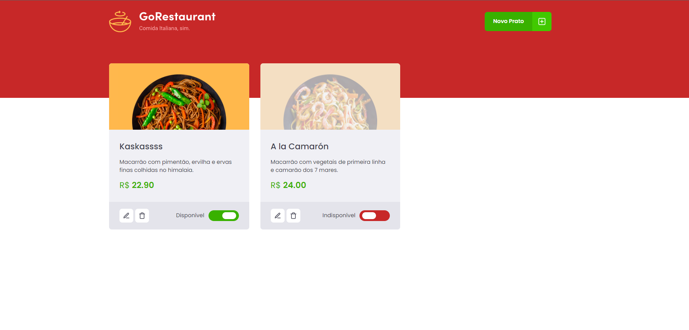

<h3 align="center">
  Challenge 04 - Refactoring: Class to Functional Components and JS to TS
</h3>

<p align="center">
  <a href="https://rocketseat.com.br">
    
  </a>
</p>

<br>

## 💻 About the challenge

<p align="center">
  
</p>

On this challenge I had to refactor the code. Changing Class Components to Functional Components and adding Typescript to the whole application.

</br>

## 🖱 Technologies

- ReactJS
- TypeScript
- Styled Components 
- Axios
- JSON Server

</br>

## ✔ Running the application

```bash

# Install all the dependencies
yarn

# Start JSON Server
yarn server

# Start the project
yarn start

```

<br>

## 📰 License

MIT. 
